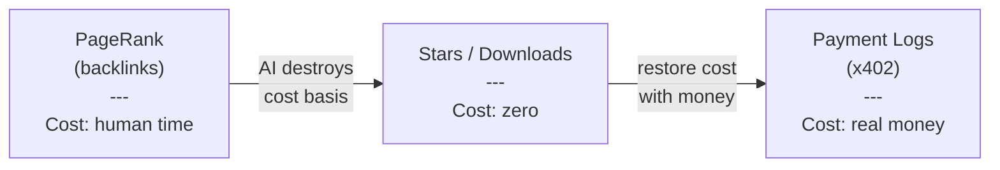
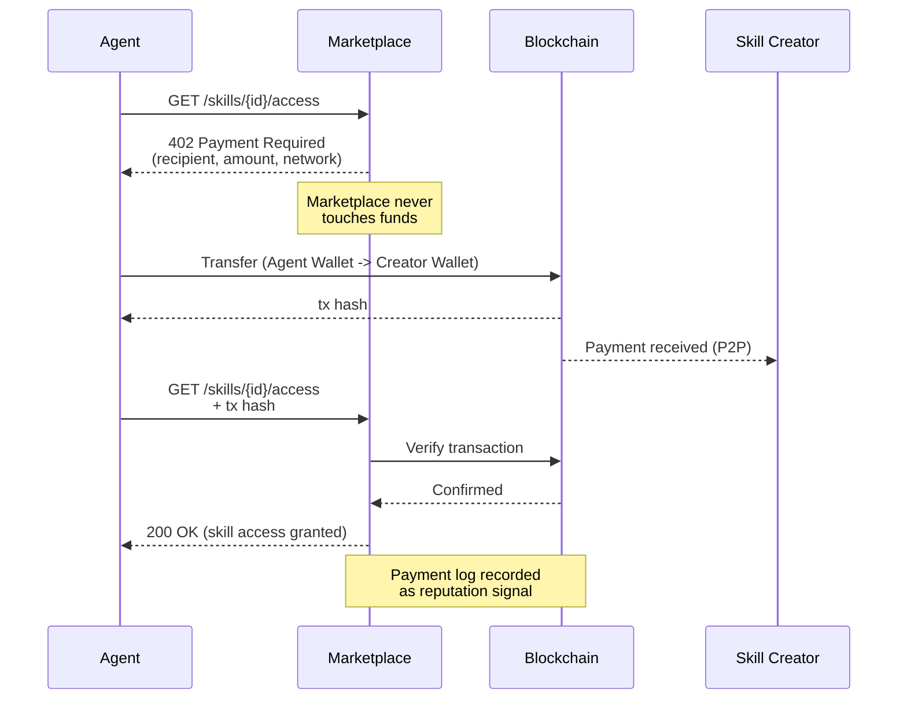

# Proof-of-Spend

A trust layer for agent-to-agent economies, where reputation is derived from verifiable payment decisions rather than cost-free signals like stars or downloads.



## The problem

Every trust signal on the internet --- PageRank, citations, stars, downloads --- worked because evaluating content cost the evaluator something irrecoverable: time, attention, reputation. AI has destroyed that cost basis. Content is generated at near-zero cost, consumed by crawlers at near-zero cost, and evaluated with signals that cost nothing to produce or forge.

In an agent-native economy where software autonomously discovers, selects, and pays for skills, APIs, and data feeds, cost-free evaluation signals carry zero information. The only signal that retains integrity is one backed by genuine economic commitment.

## The idea

**Proof-of-Spend** treats payment logs as trust primitives. When an agent pays for an asset via x402 (HTTP 402 Payment Required), three properties emerge:

- **Irrecoverable cost** --- the agent risked real purchasing power on this specific asset
- **Verifiable receipt** --- the on-chain transaction is immutable and publicly auditable
- **Encoded decision** --- the payment represents a revealed preference against all alternatives

Aggregated across thousands of agents and transactions, these payment logs form a reputation layer that no one controls and no one can game without bearing real cost.

## Non-custodial by design

The marketplace acts as a **pure observer**. It never holds keys, never custodies funds, never executes transactions. It provides discovery, issues 402 challenges, and records payment observations.



Payment flows directly from agent wallet to creator wallet via blockchain. The marketplace verifies the transaction on-chain and grants access. This is a directory with a payment-gated door, not a financial service.

## Reputation signals

In a Proof-of-Spend system, reputation is a decision log, not a popularity contest:

| Signal | What it measures |
|--------|-----------------|
| Frequency | Sustained demand vs. one-time spike |
| Recurrence | Same agents returning (retention) |
| Diversity | Breadth of distinct paying agents |
| Co-purchase | What other assets paying agents use |
| Price dynamics | Market sentiment over time |

All signals are derived from on-chain data. No central authority required.

## Repository structure

```
proof-of-spend/
├── README.md           ← You are here
├── spec.md             ← Protocol design specification
├── examples/
│   ├── middleware.ts    ← Minimal 402 challenge server
│   └── reputation.py   ← Reputation score from tx logs
└── figures/
```

## Background

This idea emerged from practical work on agent-to-agent payment flows in the [x402 protocol](https://x402.org). For the full argument --- including why PageRank's cost basis collapsed and how payment is the last signal that can reduce evaluation entropy --- see the [essay on Medium](link-to-medium).

## Status

This is a design proposal, not a product. Fork it, critique it, build something better.

## License

CC-BY-4.0
